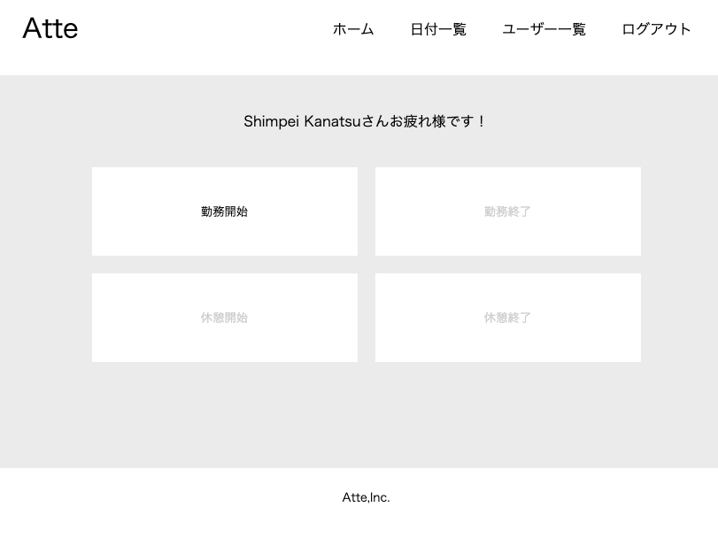
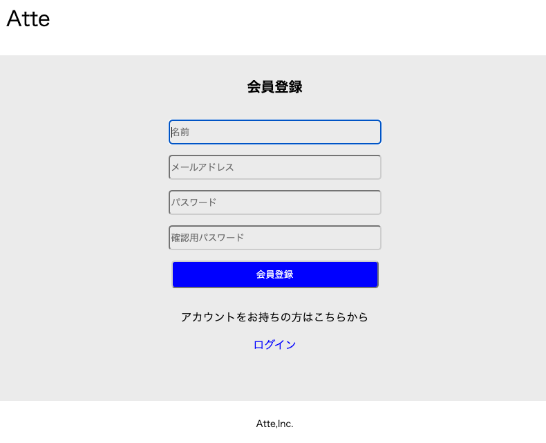
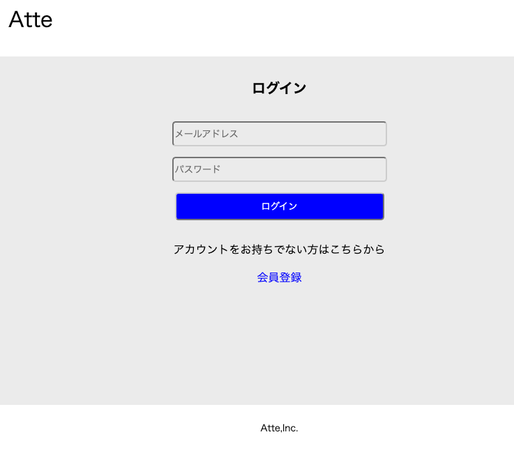
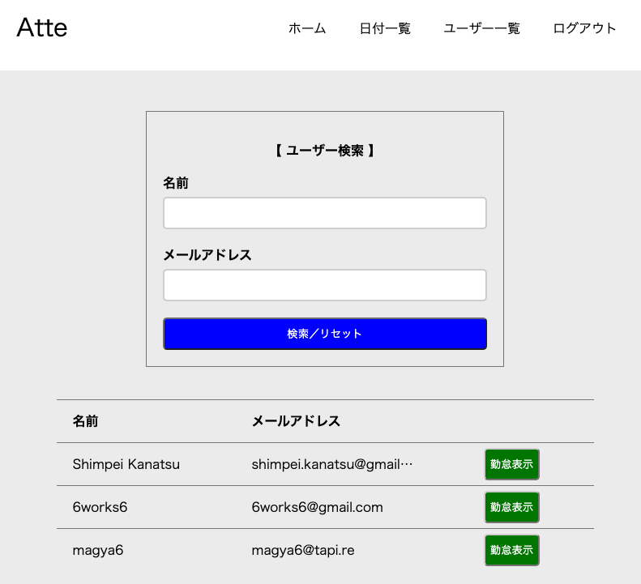
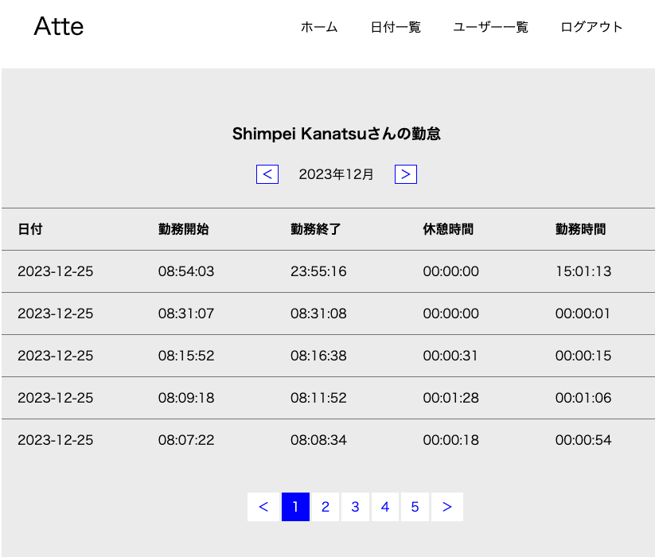
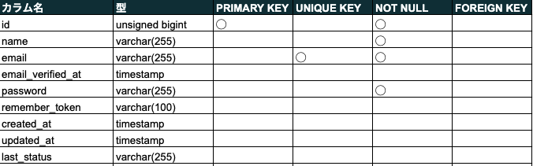
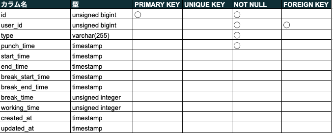
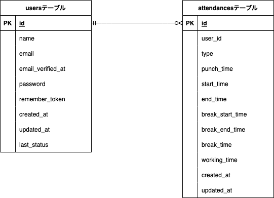

# Atte
Atteは企業の社員の勤怠管理システムです。

## 作成した目的
- 人事評価を目的としています。
- 利用者数100人達成が目標です。

## アプリケーションURL
### ページ一覧
- 会員登録ページ：<http://localhost/register>
- ログインページ：<http://localhost/login>
- 打刻（ホーム）ページ：<http://localhost/>
- 日付一覧ページ：<http://localhost/attendance>
- ユーザー一覧ページ：<http://localhost/userlist>

### 注意事項
ログインしていない状態では、打刻（ホーム）ページにアクセスするとログインページへリダイレクトします。打刻はログインした後に行ってください。

## 他のレポジトリ
なし

## 機能一覧
### 会員登録機能
名前、メールアドレス、ログイン用パスワードを入力し、会員登録ボタンを押すと、メールアドレス宛に認証用メールが届きます。
そのメール内のリンクを押下することで、会員登録が完了します。

### ログイン機能
メールアドレスとパスワードを入力し、ログインボタンを押すことで、ログインができます。

### 打刻機能
- 勤務開始ボタン
  - 勤務を開始するときに押します。
  - 勤務中や休憩中は押下できません。
- 勤務終了ボタン
  - 勤務を終了するときに押します。
  - 退勤中や休憩中は押下できません。
- 休憩開始ボタン
  - 休憩を開始するときに押します（勤務中は何度でも休憩を行うことができます）。
  - 退勤中や休憩中は押下できません。
- 休憩終了ボタン
  - 休憩を終了するときに押します。
  - 勤務中や退勤中は押下できません。

### 日付別勤怠データ確認機能
- 日付一覧ページでは、日付別に各ユーザーの勤怠データを確認できます。
- 表の上のページネーションで、表示データの日付を変更できます。
- 5件より多い勤務データがある場合は、表の下のページネーションで見ることができます。

### ユーザー確認機能
- ユーザー一覧ページでは、登録済みのユーザーデータ（名前、メールアドレス）を閲覧できます。デフォルトでは、全ユーザーが表示されています。
- 5件より多いユーザーデータがある場合は、表の下のページネーションで見ることができます。
- 【ユーザー検索】欄では、名前やメールアドレスによる、ユーザーの絞り込み検索ができます。名前やメールアドレスに条件を入力し、「検索／リセット」ボタンを押すと、条件に該当するユーザーのみ表に表示されます。なお、名前とメールアドレスの両方に条件を入力した場合は、AND検索となります。
- 絞り込み検索後、再度「検索／リセット」ボタンを押すと、絞り込みがリセットされ全ユーザーが表示されます。

- 各ユーザーデータの横の「勤怠表示」ボタンを押すと、そのユーザーの月別勤怠データが閲覧できます。
- 表の上のページネーションで、表示データの月を変更できます。
- 5件より多い勤務データがある場合は、表の下のページネーションで見ることができます。

### ログアウト機能
- グローバルナビゲーションの「ログアウト」を押すと、ログアウトできます。

## 使用技術（実行環境）
- フロントエンド
  - HTML
  - CSS
  - JavaScript
- バックエンド
  - PHP 8.2.13
  - Laravel 10.35.0
  - MySQL 8.2.0
- インフラ
  - Docker（開発環境）
- その他
  - GitHub

## テーブル設計
### usersテーブル

### attendancesテーブル

## ER図

## 環境構築
- ローカル環境にてサーバーを立ち上げるには、下記コマンドを入力してください。
  - ./vendor/bin/sail up
- その後、JavaScriptを有効にするため、下記コードも入力してください。
  - npm run dev

## 他
### 作成済みのテスト用ユーザーデータ
パスワードはいずれも「twiligor」。
- Shimpei Kanatsu sk7@gmail.com
- 5work9 5work9@gmail.com
- magya6	magya6@tapi.re
- yuhi175	yuhi175@tapi.re
- 山田　太郎	hahihepu@instaddr.ch
- 鈴木花子	byoryowa153@fuwamofu.com

### 1日を超える勤務時間（日を跨ぐ勤務）について
勤務時間が1日以上となる場合、勤務時間・休憩時間を正確に計算できません。勤務時間は1日以内に収まるよう、打刻をしてください。# 20240105_kanatsu_Atte
