# Rese
Reseは企業のグループ会社の飲食店予約サービスです。

## 作成した目的
- 外部の飲食店予約サービスは手数料を取られるので、自社で予約サービスを持つことを目的としています。
- 初年度の利用者数10,000人達成が目標です。

## アプリケーションURL
### ページ一覧
- 会員登録ページ：<http://localhost/register>
- サンクスページ：<http://localhost/thanks>
- ログインページ：<http://localhost/login>
- マイページ：<http://localhost/mypage>
- 飲食店一覧ページ：<http://localhost/>
- 飲食店詳細ページ：<http://localhost/detail/1>
- 予約完了ページ：<http://localhost/done>
- 評価ページ：<http://localhost/review/1>
- メニューページ：<http://localhost/menu>

### 注意事項
- ログインしていない状態では、飲食店の予約やお気に入り登録、評価ができません。それらはログインした後に行ってください。
- 評価ページにアクセスできるのは一般ユーザーのみです。URLで直接アクセスしようとすると、未ログインの場合はログインページへリダイレクトし、店舗代表者ユーザーまたは管理者ユーザーとしてログイン中の場合はトップページへリダイレクトします。

## 他のレポジトリ
なし

## 機能一覧
### 会員登録機能
名前、メールアドレス、ログイン用パスワードを入力し、ユーザータイプを選択の上、登録ボタンを押すと、メールアドレス宛に認証用メールが届きます。
- ユーザータイプ
  - 一般ユーザー：お客様用のアカウント
  - 店舗ユーザー：店舗代表者用のアカウント
  - 管理者ユーザー：管理者用のアカウント
- 認証用メール内のリンクを押下することで、会員登録が完了します。（リンクをクリックしていなくても、ログイン自体は可能です。ただし、お店の予約や、マイページの閲覧はできません）

### ログイン機能
メールアドレスとパスワードを入力し、ログインボタンを押すことで、ログインができます。

### ログアウト機能
メニューページの「Logout」を押すと、ログアウトできます。

### メニュー機能
画面左上のアイコンを押下すると、メニュー画面が表示されます。
- 未ログインの時
  - Home（飲食店一覧ページ）、会員登録ページ、ログインページに遷移できます。

- ログイン済みの時
  - Home（飲食店一覧ページ）、マイページに遷移できます。
  - 「Logout」を押下するとログアウトし、飲食店一覧ページに戻ります。

### 飲食店一覧表示機能
- 飲食店一覧ページでは、各店の概要が表示されます。
- 飲食店一覧ページの右上のフォームから、エリア・ジャンル・店名による絞り込みができます（AND検索）。
- 「詳しくみる」ボタンを押下すると、店舗詳細ページに遷移します。
- ログイン済みの場合、各店ごとにハートマークが表示されます。押下するごとに、赤色・灰色に変化します。
  - 赤色がお気に入り登録済み、灰色が未登録の状態です。
  - お身に入り登録済み店舗は、マイページに表示されます。

- 一般ユーザーとしてログイン済みの場合、ページ上部に並び替えボタンが表示されます。
  - 並び替えボタンを押下すると、並び替え方法を選べる欄が表示されます。
    - ランダム：押下するごとに、店舗がランダムに並び替えられます。
    - 評価が高い順：店舗の評価が高い順に並び替えられます。
    - 評価が低い順：店舗の評価が低い順に並び替えられます。
      - 店舗の評価は、各5段階評価の平均値でリアルタイムに計算されます。
      - 評価が1件もない店舗は、「評価が高い順」「評価が低い順」のどちらの場合でも、最後尾に表示されます。

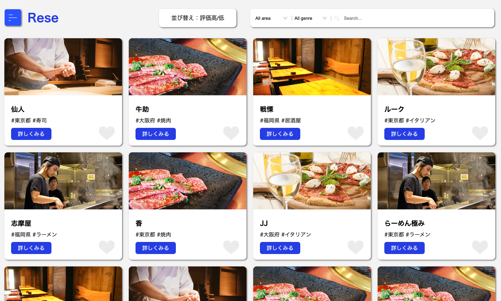

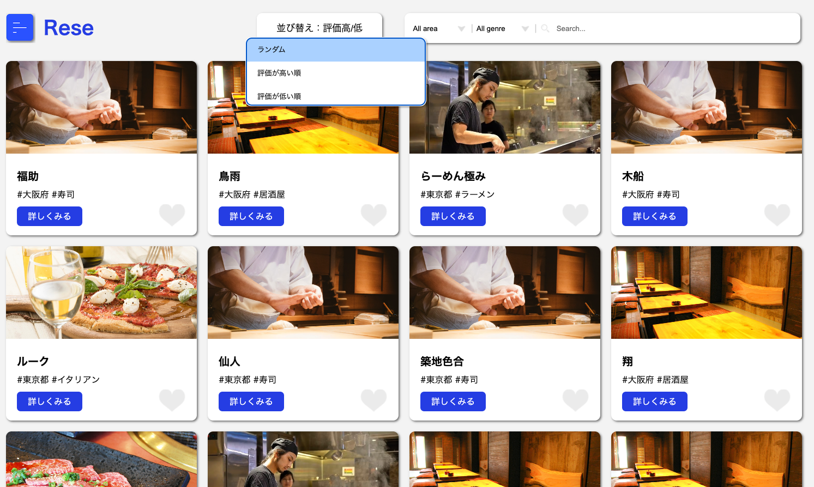

### 飲食店詳細表示機能
- 飲食店詳細ページでは、各店の詳細が表示されます。
- 評価が送られた店舗には、「全ての口コミ情報」欄に評価（5段階評価のスコア、コメント）が表示されます。
- ログイン済みの場合、予約フォームが表示されます。日時や人数を選択し、「予約する」ボタンを押下すると、予約できます（当日予約は店舗が対応しきれない可能性があるため、翌日以降の日時しか予約できません）。

### 評価機能
- 一般ユーザーは、飲食店詳細ページの「口コミを投稿する」リンクを押下すると、その店舗の評価を送信できるページに遷移します。
  - 予約なしの来店を想定し、予約の有無にかかわらず評価が可能となっています。

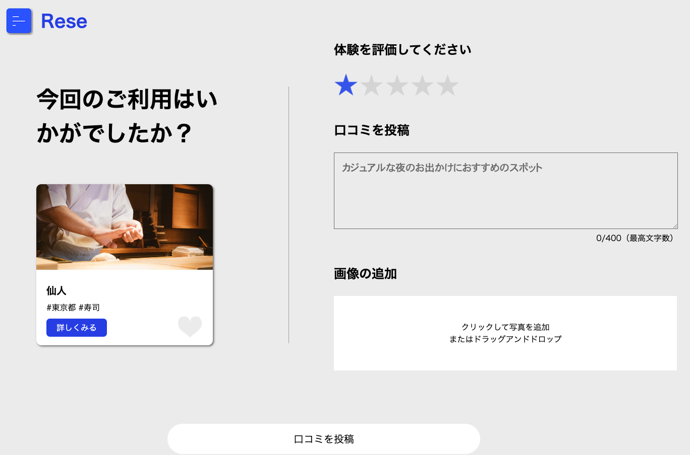
- 星マークにマウスオーバーすると、色が灰色から青色に変わります。満足度に応じて、押下することで、5段階評価を選択できます。

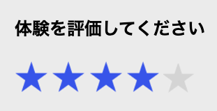
- 「口コミを投稿」欄に、コメントを入力できます。
  - 入力欄の直下に、入力中の文字数が表示されます。
  - 最高文字数は400文字です。それを超えると、エラーメッセージが表示され、「口コミを投稿」ボタンを押下できなくなります。
  - 必須項目ではありません。

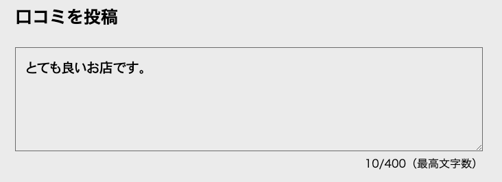
- 「画像の追加」欄をクリック、またはドラッグ&ドロップすることで、写真を追加することができます。
  - jpeg, pngファイルのみアップロード可能です。それ以外のファイル形式では、エラーメッセージが表示されます。
  - アップロードすると、画像のプレビューが表示されます。また、「画像を削除」ボタンを押下すると、アップロードした画像を削除できます。
  - アップロードした画像は、storage/app/public/imagesディレクトリ内に保存されます。データベースでは、review_image_urlにファイル名が記録されます。
  - 必須項目ではありません。

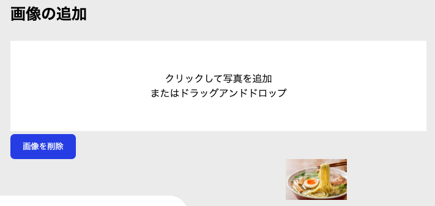
- 「口コミを投稿」ボタンを押下すると、評価が送信され、当該飲食店の詳細ページに戻ります。「全ての口コミ情報」欄には、送信した評価が表示されます。
  - 5段階評価（score）に応じて、見出しが表示されます。
    - 5点：大変満足です
    - 4点：満足です
    - 3点：普通です
    - 2点：不満です
    - 1点：大変不満です
  - 評価送信済みの場合、「口コミを編集」ボタン、または「口コミを投稿する」ボタンを押下すると、評価送信ページに遷移します。
    - 前回送信済みの評価内容が表示されます。
    - 内容を更新し、「口コミを投稿」ボタンを押下することで、評価を再送信（上書き）できます。
    - 1店舗につき、1つの評価しか送信できません。
    - 送信済みの画像を更新することは可能ですが、単に削除することはできません。
  - 「口コミを削除」ボタンを押下すると、当該評価を削除できます。

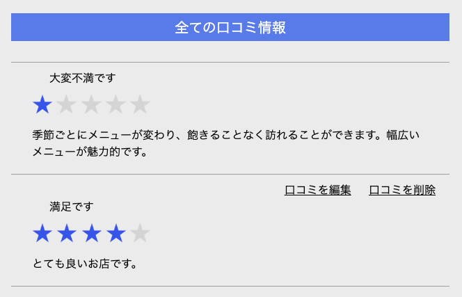
- ユーザータイプによる仕様の違い
  - 一般ユーザー：自身が投稿した評価のみ、編集・削除が可能です。
  - 店舗ユーザー：評価の閲覧は可能ですが、新規送信・編集・削除はできません。
  - 管理者ユーザー：全ての評価の削除が可能ですが、新規送信・編集はできません。

### 予約情報とQRコードの表示、予約の更新・削除機能
- マイページでは、予約内容と、利用者が来店した際に店舗側に見せるQRコードが表示されます。
  - 予約日時の過ぎた（来店済みの）予約については、「ご来店済み」と表示され、QRコードは非表示となります。

- 予約日時が過ぎる前（来店前）であれば、予約の変更や削除が可能です。
  - 「▼予約変更はこちら」欄にて、変更したい日時・人数を選択し、「予約変更」ボタンを押下すると、予約情報が更新できます。
  - バツボタンを押下すると、予約が削除されます。

### 決済機能
- マイページの予約状況欄では、予約日時が過ぎる前（来店前）であれば、「来店前の決済はこちら」ボタンを押下することで、事前決済（STRIPEを使用）ができます。
  - 事前決済を完了すると、自動的にマイページへ戻ります。

### お気に入り店舗表示機能
- マイページでは、お気に入り店舗が表示されます。
- 「詳しくみる」ボタンを押下すると、店舗詳細ページに遷移します。
- ハートマークを押下すると、お気に入りが解除され、「お気に入り店舗」欄から削除されます。

### 店舗情報のCSVインポート機能
- 管理者ユーザーのトップページでは、ページ上部に「店舗情報のアップロード」欄が表示されます。

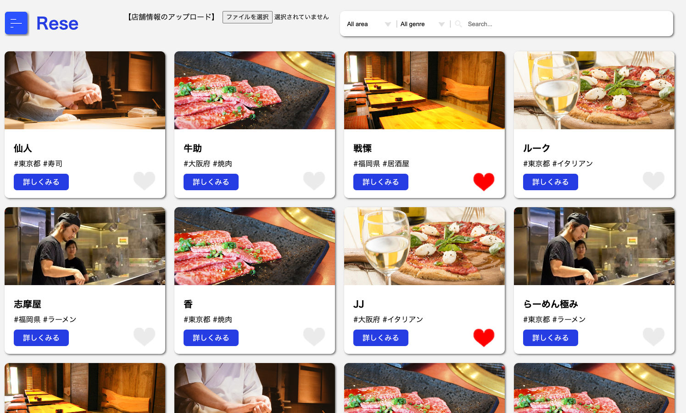

- ボタンを押下し、店舗情報を記載したCSVファイルをアップロードすると、「CSVをインポート」ボタンが表示されます。このボタンを押下すると、店舗情報が追加されます（既存店舗の更新ではなく、新規店舗の追加です）。
  
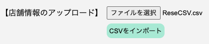

- ファイルの形式や入力の不足、誤りがあると（下記条件の全てを満たさないと）、店舗情報は追加できず、エラーメッセージが表示されます。
  - ファイル形式はCSV
  - 下記項目は全て入力必須
    - 店舗名：50文字以内
    - 地域：「東京都」「大阪府」「福岡県」のいずれか
    - ジャンル：「寿司」「焼肉」「イタリアン」「居酒屋」「ラーメン」のいずれか
    - 店舗概要：400文字以内
    - 画像URL：jpeg、pngのみアップロード可能

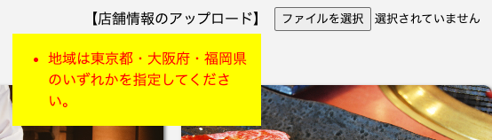

- サンプルのCSVファイルは、プロジェクトフォルダ直下に「ReseCSV.csv」として保存してあります。本ファイルをアップロードして、サンプルの店舗情報を追加できます。
  - 1行目に項目名、2行目以降に店舗情報を入力します
  - 1行目の項目名は、左からshopname（店舗名）, area（地域）, genre（ジャンル）, description（店舗概要）, image_url（画像URL）とします
  - image_urlには、既にネット上に公開されている画像のURLを入力します

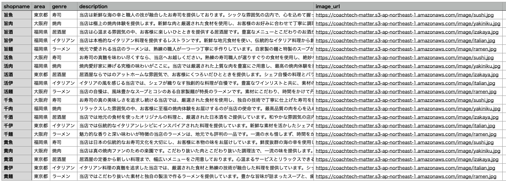

## 使用技術（実行環境）
- フロントエンド
  - HTML
  - CSS
  - JavaScript
- バックエンド
  - PHP 8.2.13
  - Laravel 10.35.0
  - MySQL 8.2.0
- インフラ
  - Docker（開発環境）
- その他
  - GitHub
  - Stripe（決済機能）

## テーブル設計
### usersテーブル

### shopsテーブル

### favoritesテーブル

### reservationsテーブル

### reviewsテーブル

## ER図

## 開発環境構築
### ①.envファイルの作成
- .env.example ファイルを .env ファイルとしてコピーし、下記のとおり編集します。

APP_NAME=Laravel
APP_ENV=local
APP_KEY=base64:OQ7I3ELOq6ZMh5Hi9gX28BVPun2bfG6dG4pV7fLNypc=
APP_DEBUG=true
APP_URL=http://localhost

LOG_CHANNEL=stack
LOG_DEPRECATIONS_CHANNEL=null
LOG_LEVEL=debug

DB_CONNECTION=mysql
DB_HOST=mysql
DB_PORT=3306
DB_DATABASE=test_project
DB_USERNAME=sail
DB_PASSWORD=password
WWWUSER=sail
WWWGROUP=sail

BROADCAST_DRIVER=log
CACHE_DRIVER=file
FILESYSTEM_DISK=local
QUEUE_CONNECTION=database
SESSION_DRIVER=file
SESSION_LIFETIME=120

MEMCACHED_HOST=127.0.0.1

REDIS_HOST=redis
REDIS_PASSWORD=null
REDIS_PORT=6379

MAIL_DRIVER=smtp
MAIL_HOST=smtp.gmail.com
MAIL_PORT=587
MAIL_USERNAME=atte.master6@gmail.com
MAIL_PASSWORD=dzrvqlmwbwkwfgip
MAIL_ENCRYPTION=tls
MAIL_FROM_ADDRESS=atte.master6@gmail.com
MAIL_FROM_NAME=Rese
MAIL_DRIVER=log

AWS_ACCESS_KEY_ID=
AWS_SECRET_ACCESS_KEY=
AWS_DEFAULT_REGION=us-east-1
AWS_BUCKET=
AWS_USE_PATH_STYLE_ENDPOINT=false

PUSHER_APP_ID=
PUSHER_APP_KEY=
PUSHER_APP_SECRET=
PUSHER_HOST=
PUSHER_PORT=443
PUSHER_SCHEME=https
PUSHER_APP_CLUSTER=mt1

VITE_APP_NAME="${APP_NAME}"
VITE_PUSHER_APP_KEY="${PUSHER_APP_KEY}"
VITE_PUSHER_HOST="${PUSHER_HOST}"
VITE_PUSHER_PORT="${PUSHER_PORT}"
VITE_PUSHER_SCHEME="${PUSHER_SCHEME}"
VITE_PUSHER_APP_CLUSTER="${PUSHER_APP_CLUSTER}"

SCOUT_DRIVER=meilisearch
MEILISEARCH_HOST=http://meilisearch:7700

MEILISEARCH_NO_ANALYTICS=false

SSTRIPE_API_KEY=pk_test_51OlSW7H2PN2teyfS1jwGbE1IrJulRMOHg27kH0I6XfKjX17ZzGH4mfpJg8Kur96C92ijdrZ2dr90SfWmhsTQzcCu00yaa2MBWa
STRIPE_SECRET_KEY=sk_test_51OlSW7H2PN2teyfS0sHqv9qxRjiCFlohx0T7NLdgjnxGYBy6yUSPFb3LJtj33imVyyQf388yPeYQvLLNLSb7uZdI00gIx0vHU0

### ②Docker Compose を利用した開発環境構築
- Docker Desktopをインストールし、さらにDocker Composeをインストールします。
- docker-compose.yml ファイルの内容を確認します。
- 下記コマンドにて、コンテナを起動します。
  - docker-compose up -d

### ③サーバーの立ち上げ、アクセスの確認
- ローカル環境にてサーバーを立ち上げるには、下記コマンドを入力してください。
  - ./vendor/bin/sail up
- その後、JavaScriptを有効にするため、下記コードも入力してください。
  - npm run dev
- http://localhost/ にアクセスできるか確認します。アクセスできたら成功です。

### ④マイグレーションコマンド
- 下記コマンドで、Sailコンテナ内でデータベースのマイグレーションが実行されます。
  - ./vendor/bin/sail shell
  - php artisan migrate

### ⑤ダミーデータ作成コマンド
- 下記コマンドで、ダミーデータを作成できます（Seederを使用）。
  - ./vendor/bin/sail shell
  - php artisan db:seed

### データベースをリフレッシュするコマンド
php artisan migrate:refresh

## 他
### テスト用ユーザーデータ（20件）
Seederファイルにて、ダミーデータを作成可能。
- ユーザー名｜メールアドレス｜パスワード｜ユーザータイプ
- User1｜user1@example.com｜password1｜general
- User2｜user2@example.com｜password2｜general
・・・
- User20｜user20@example.com｜password20｜manage

### その他のダミーデータ
shops、reservations、reviews、favoritesテーブルについて、Seederファイルにてダミーデータを作成可能。
