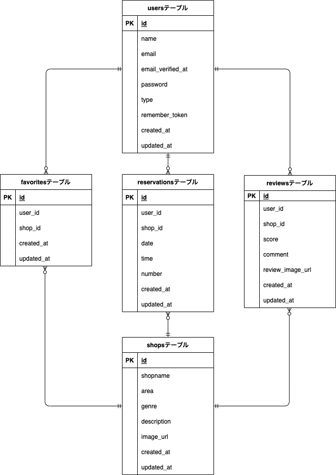

# Rese
Reseは企業のグループ会社の飲食店予約サービスです。

## 作成した目的
- 外部の飲食店予約サービスは手数料を取られるので、自社で予約サービスを持つことを目的としています。
- 初年度の利用者数10,000人達成が目標です。

## アプリケーションURL
### ページ一覧
- 会員登録ページ：<http://localhost/register>
- サンクスページ：<http://localhost/thanks>
- ログインページ：<http://localhost/login>
- マイページ：<http://localhost/mypage>
- 飲食店一覧ページ：<http://localhost/>
- 飲食店詳細ページ：<http://localhost/detail/1>
- 予約完了ページ：<http://localhost/done>
- メニューページ：<http://localhost/menu>

### 注意事項
ログインしていない状態では、飲食店の予約やお気に入り登録、評価ができません。それらはログインした後に行ってください。

## 他のレポジトリ
なし

## 機能一覧
### 会員登録機能
名前、メールアドレス、ログイン用パスワードを入力し、登録ボタンを押すと、メールアドレス宛に認証用メールが届きます。
そのメール内のリンクを押下することで、会員登録が完了します。（リンクをクリックしていなくても、ログイン自体は可能です。ただし、お店の予約や、マイページの閲覧はできません）

### ログイン機能
メールアドレスとパスワードを入力し、ログインボタンを押すことで、ログインができます。

### ログアウト機能
メニューページの「Logout」を押すと、ログアウトできます。

### メニュー機能
画面左上のアイコンを押下すると、メニュー画面が表示されます。
- 未ログインの時
  - Home（飲食店一覧ページ）、会員登録ページ、ログインページに遷移できます。

- ログイン済みの時
  - Home（飲食店一覧ページ）、マイページに遷移できます。
  - 「Logout」を押下するとログアウトし、飲食店一覧ページに戻ります。

### 飲食店一覧表示機能
- 飲食店一覧ページでは、各店の概要が表示されます。
- 飲食店一覧ページの右上のフォームから、エリア・ジャンル・店名による絞り込みができます（AND検索）。
- 「詳しくみる」ボタンを押下すると、店舗詳細ページに遷移します。
- ログイン済みの場合、各店ごとにハートマークが表示されます。押下するごとに、赤色・灰色に変化します。
  - 赤色がお気に入り登録済み、灰色が未登録の状態です。
  - お身に入り登録済み店舗は、マイページに表示されます。

### 飲食店詳細表示機能
- 飲食店詳細ページでは、各店の詳細が表示されます。
- 評価が送られた店舗には、「お客様の声」欄に評価（5段階評価のスコア、コメント）が表示されます。
- ログイン済みの場合、予約フォームが表示されます。日時や人数を選択し、「予約する」ボタンを押下すると、予約できます（当日予約は店舗が対応しきれない可能性があるため、翌日以降の日時しか予約できません）。

### 予約情報とQRコードの表示、予約の更新・削除機能
- マイページでは、予約内容と、利用者が来店した際に店舗側に見せるQRコードが表示されます。
  - 予約日時の過ぎた（来店済みの）予約については、「ご来店済み」と表示され、QRコードは非表示となります。

- 予約日時が過ぎる前（来店前）であれば、予約の変更や削除が可能です。
  - 「▼予約変更はこちら」欄にて、変更したい日時・人数を選択し、「予約変更」ボタンを押下すると、予約情報が更新できます。
  - バツボタンを押下すると、予約が削除されます。

### 決済機能
- マイページの予約状況欄では、予約日時が過ぎる前（来店前）であれば、「来店前の決済はこちら」ボタンを押下することで、事前決済（STRIPEを使用）ができます。
  - 事前決済を完了すると、自動的にマイページへ戻ります。

### 評価機能
- マイページでは、予約日時の過ぎた（来店済みの）店舗に対し、評価を送ることができます。
  - 「評価を送る」ボタンを押下すると、評価の入力フォームが表示されます。
  - 評価スコアを選択、評価コメントを入力し、「評価送信」ボタンを押下すると、評価が送信されます。
  - 1つの予約につき、1つの評価が送信できます。
    - 同じ店舗でも、予約ごとに評価を送信できます。
    - 同じ予約に対し、評価を複数回送信すると、送信済みの評価は上書きされます。
    - 送信した評価を取り消すことはできません。

### お気に入り店舗表示機能
- マイページでは、お気に入り店舗が表示されます。
- 「詳しくみる」ボタンを押下すると、店舗詳細ページに遷移します。
- ハートマークを押下すると、お気に入りが解除され、「お気に入り店舗」欄から削除されます。

## 使用技術（実行環境）
- フロントエンド
  - HTML
  - CSS
  - JavaScript
- バックエンド
  - PHP 8.2.13
  - Laravel 10.35.0
  - MySQL 8.2.0
- インフラ
  - Docker（開発環境）
- その他
  - GitHub
  - Stripe（決済機能）

## テーブル設計
### usersテーブル

### shopsテーブル

### favoritesテーブル

### reservationsテーブル

### reviewsテーブル

## ER図

## 開発環境構築
### .envファイルの作成
- .env.example ファイルを .env ファイルとしてコピーし、下記のとおり編集します。

APP_NAME=Laravel
APP_ENV=local
APP_KEY=base64:OQ7I3ELOq6ZMh5Hi9gX28BVPun2bfG6dG4pV7fLNypc=
APP_DEBUG=true
APP_URL=http://localhost

LOG_CHANNEL=stack
LOG_DEPRECATIONS_CHANNEL=null
LOG_LEVEL=debug

DB_CONNECTION=mysql
DB_HOST=mysql
DB_PORT=3306
DB_DATABASE=test_project
DB_USERNAME=sail
DB_PASSWORD=password
WWWUSER=sail
WWWGROUP=sail

BROADCAST_DRIVER=log
CACHE_DRIVER=file
FILESYSTEM_DISK=local
QUEUE_CONNECTION=database
SESSION_DRIVER=file
SESSION_LIFETIME=120

MEMCACHED_HOST=127.0.0.1

REDIS_HOST=redis
REDIS_PASSWORD=null
REDIS_PORT=6379

MAIL_DRIVER=smtp
MAIL_HOST=smtp.gmail.com
MAIL_PORT=587
MAIL_USERNAME=atte.master6@gmail.com
MAIL_PASSWORD=dzrvqlmwbwkwfgip
MAIL_ENCRYPTION=tls
MAIL_FROM_ADDRESS=atte.master6@gmail.com
MAIL_FROM_NAME=Rese
MAIL_DRIVER=log

AWS_ACCESS_KEY_ID=
AWS_SECRET_ACCESS_KEY=
AWS_DEFAULT_REGION=us-east-1
AWS_BUCKET=
AWS_USE_PATH_STYLE_ENDPOINT=false

PUSHER_APP_ID=
PUSHER_APP_KEY=
PUSHER_APP_SECRET=
PUSHER_HOST=
PUSHER_PORT=443
PUSHER_SCHEME=https
PUSHER_APP_CLUSTER=mt1

VITE_APP_NAME="${APP_NAME}"
VITE_PUSHER_APP_KEY="${PUSHER_APP_KEY}"
VITE_PUSHER_HOST="${PUSHER_HOST}"
VITE_PUSHER_PORT="${PUSHER_PORT}"
VITE_PUSHER_SCHEME="${PUSHER_SCHEME}"
VITE_PUSHER_APP_CLUSTER="${PUSHER_APP_CLUSTER}"

SCOUT_DRIVER=meilisearch
MEILISEARCH_HOST=http://meilisearch:7700

MEILISEARCH_NO_ANALYTICS=false

SSTRIPE_API_KEY=pk_test_51OlSW7H2PN2teyfS1jwGbE1IrJulRMOHg27kH0I6XfKjX17ZzGH4mfpJg8Kur96C92ijdrZ2dr90SfWmhsTQzcCu00yaa2MBWa
STRIPE_SECRET_KEY=sk_test_51OlSW7H2PN2teyfS0sHqv9qxRjiCFlohx0T7NLdgjnxGYBy6yUSPFb3LJtj33imVyyQf388yPeYQvLLNLSb7uZdI00gIx0vHU0

### Docker Compose を利用した開発環境構築
- Docker Desktopをインストールし、さらにDocker Composeをインストールします。
- docker-compose.yml ファイルの内容を確認します。
- 下記コマンドにて、コンテナを起動します。
  - docker-compose up -d

### サーバーの立ち上げ、アクセスの確認
- ローカル環境にてサーバーを立ち上げるには、下記コマンドを入力してください。
  - ./vendor/bin/sail up
- その後、JavaScriptを有効にするため、下記コードも入力してください。
  - npm run dev
- http://localhost/ にアクセスできるか確認。アクセスできたら成功です。

### マイグレーションコマンド
- 下記コマンドで、Sailコンテナ内でデータベースのマイグレーションが実行されます。
  - ./vendor/bin/sail shell
  - php artisan migrate

### ダミーデータ作成コマンド
- 下記コマンドで、ダミーデータを作成できます（Seederを使用）。
  - ./vendor/bin/sail shell
  - php artisan db:seed

### データベースをリフレッシュするコマンド
php artisan migrate:refresh

## 他
### 作成済みのテスト用ユーザーデータ（20件）

- ユーザー名｜メールアドレス｜パスワード
- User1｜user1@example.com｜password1
- User2｜user2@example.com｜password2
・・・
- User20｜user20@example.com｜password20

### 作成済みの他ダミーデータ
shops、reservations、reviews、favoritesテーブルについて、Seederファイルにてダミーデータを作成済み。
